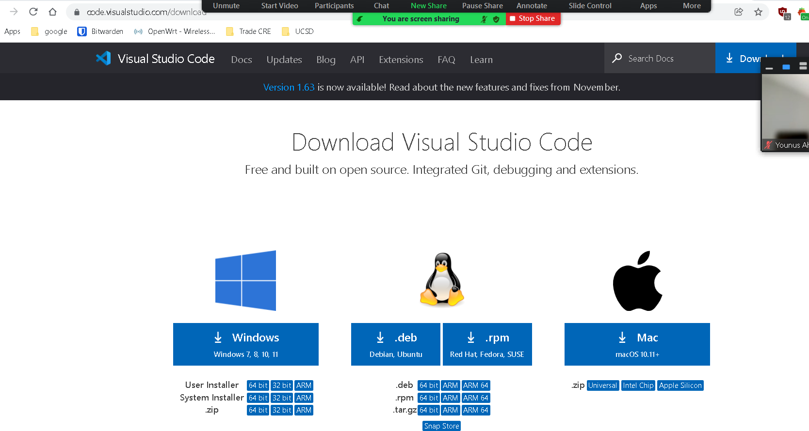
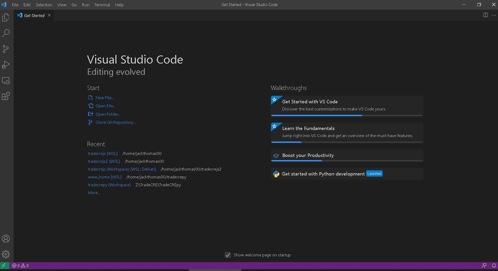
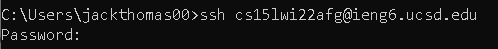
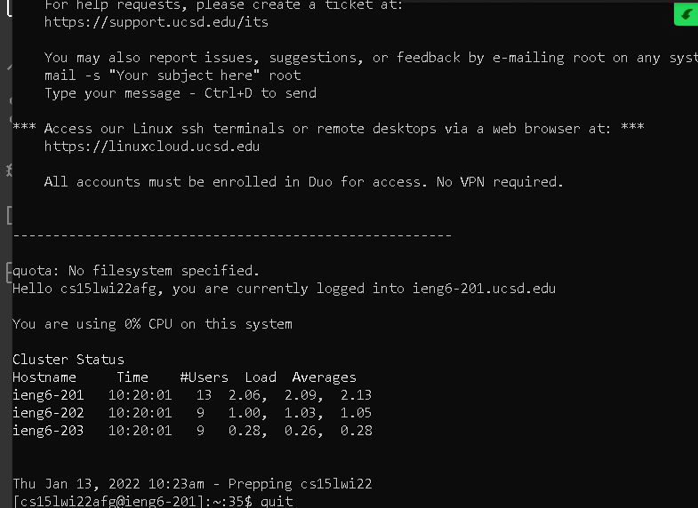
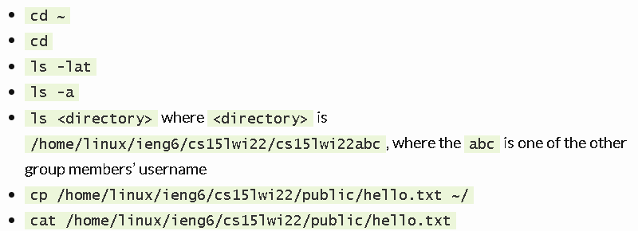
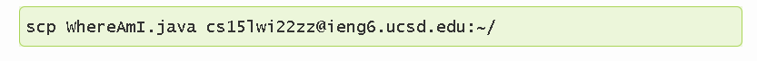
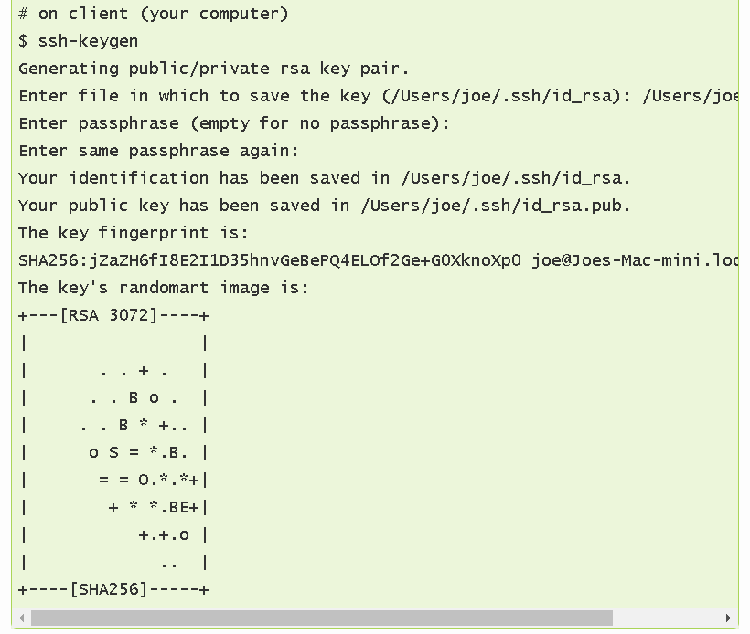

Go to code.visualstudio.com to download visual studio code.

After downloading visual studio code go to https://sdacs.ucsd.edu/~icc/index.php and look up your account with UCSD. I believe you change your password and find the email associated with your account. All that is different is the last 3 characters after wi22. You then have to install SSH. 
Follow this tutorial https://docs.microsoft.com/en-us/windows-server/administration/openssh/openssh_install_firstuse. 

After you can log in like seen below. Password is the one created in the lookup.

Once you are logged in you should see this.

Then you can try any one of these commands.

After trying commands, logout using exit. Then create a file called WhereAmI.java on your local machine. Then type this command. With your modified email.

Next create an ssh key on your computer using this command. “ssh-keygen”.

Since I am on windows there are extra steps at this link. https://docs.microsoft.com/en-us/windows-server/administration/openssh/openssh_keymanagement#user-key-generation. 

`$ ssh cs15lwi22zz@ieng6.ucsd.edu`
<Enter Password>
# now on server
`$ mkdir .ssh`
`$ exit`
# back on client
`$ scp /Users/joe/.ssh/id_rsa.pub cs15lwi22@ieng6.ucsd.edu:~/.ssh/authorized_keys`
You use your username and the path you saw in the command above

You can write a command in quotes at the end of an ssh command to directly run it on the remote server, then exit. For example, this command will log in and list the home directory on the remote server:

`$ ssh cs15lwi22@ieng6.ucsd.edu "ls"`

You can use semicolons to run multiple commands on the same line in most terminals. For example, try:

`$ cp WhereAmI.java OtherMain.java; javac OtherMain.java; java WhereAmI`
