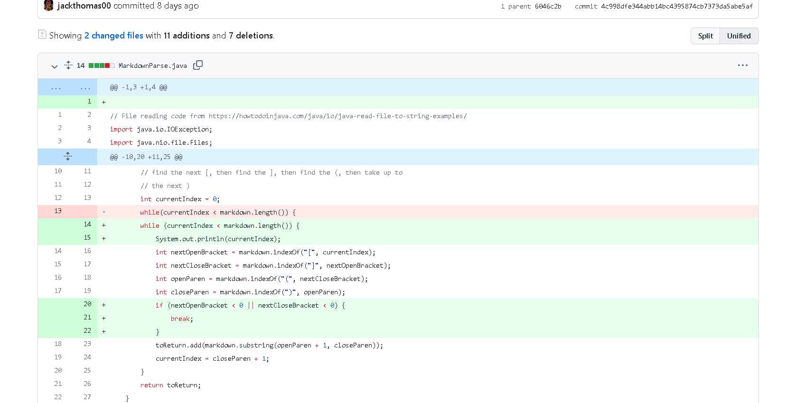
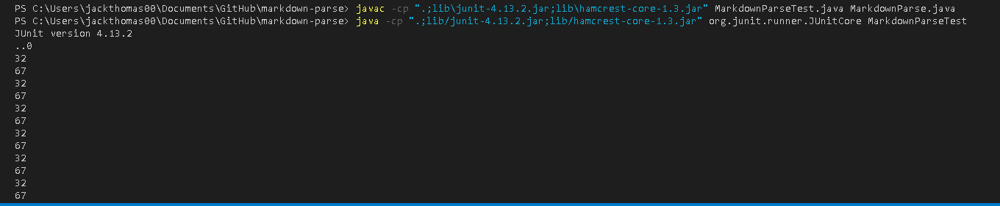
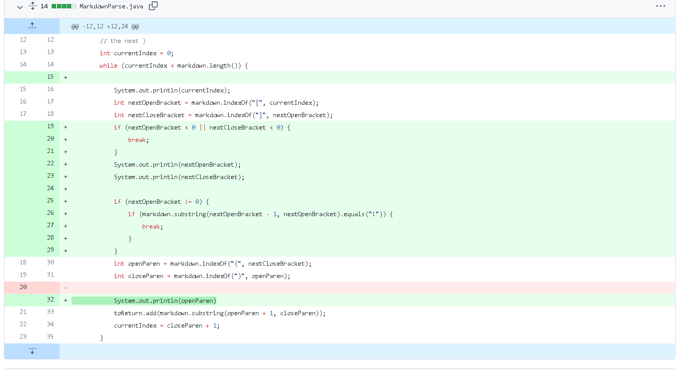
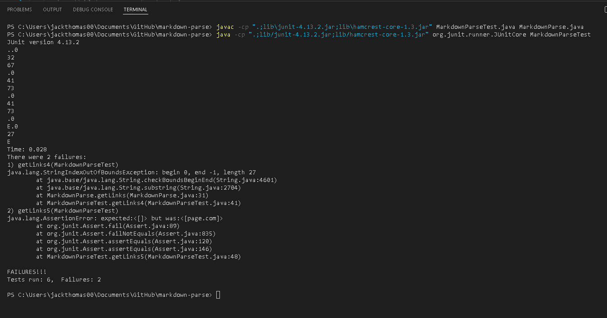
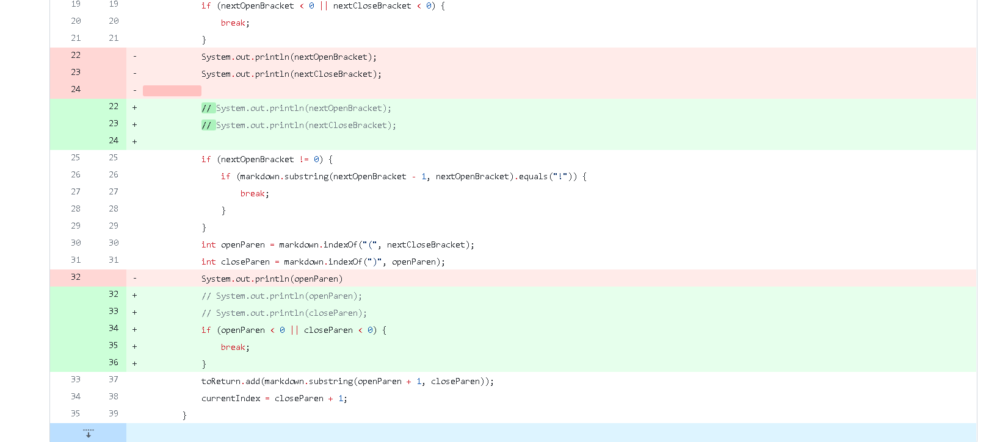
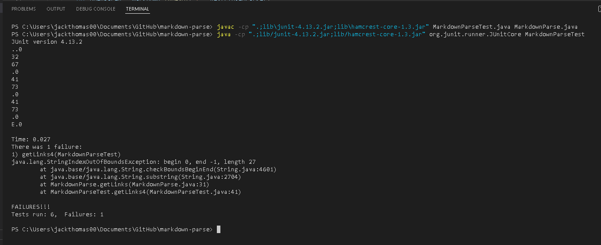

# Lab Report 2 Week 4

## Change 1

I added an if to check if we are getting -1 for finding the two brackets which caused the infinite loop.

Here is failure inducing test file.

[link to file!](https://github.com/jackthomas00/markdown-parse/blob/main/test-file3.md)

Here is output of that input.

The bug is we are not skipping over lines without parentheses. When there is not a close parentheses the current index gets set to 0 so it gets caught in a infinite loop of finding the next brackets and parentheses. The output is the same position of the same two close parentheses over and over again.

## Change 2

Added the second if on line 25 to check if we are adding an image by mistake and breaks out from adding that if we are. 

Here is failure inducing test file.

[link to file!](https://github.com/jackthomas00/markdown-parse/blob/main/test-file5.md)

Here is output of that input.

The bug is we add a link because we don't check if it starts with an "!" or not. The symptom is a wrong result of getting a link when we should not. The failure inducing input is a link.

## Change 3

Here we check to make sure we don't try to add a link that doesn't exist if there are no parentheses. If there are no parentheses we break out of the loop.

Here is failure inducing test file.

[link to file!](https://github.com/jackthomas00/markdown-parse/blob/main/test-file4.md)

Here is output of that input.

The bug is still with parentheses. If there are no parentheses then we try to get a link between 0 and -1 which throws out of bounds error. The symptom is an out of bounds error. The input is a blank line inbetween the links and random text.
