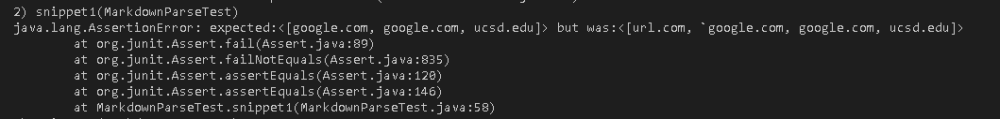

# Links to mine and Kathy's markdown parse github directory

[link to my md-parse](https://github.com/jackthomas00/markdown-parse)

[link to kathy's md-parse](https://github.com/kathyychenn/markdown-parse)

# Snippet 1

It should produce 3 links; 2 of which are google.com and the other is ucsd.edu

Here is the code to test this case.

### Expected Result

### Result for my code

Summary of fix for my code change if (<10 lines) ish

I think there is small fix of just having an if for backticks to make sure they are not included in the link.

### Kathy's code result

# Snippet 2

It should produce 3 links; "a.com", "a.com(())", and "example.com"

Here is the code to test this case.

### Expected Result

### Result for my code

Summary of fix for my code change if (<10 lines) ish

I think this a more involved fix similar to the function shown in class of creating something to keep track of open and close parentheses so that one close paretheneses doesn't end the link.

### Kathy's code result

# Snippet 3

It should produce 3 links;  "https://www.twitter.com", "https://ucsd-cse15l-w22.github.io/", and "https://cse.ucsd.edu/"

Here is the code to test this case.

### Expected Result

### Result for my code

Summary of fix for my code change if (<10 lines) ish

I think the fix to snippet 3 would be using trim to get rid of blank lines so that way blank lines are included in the link. 

### Kathy's code result

