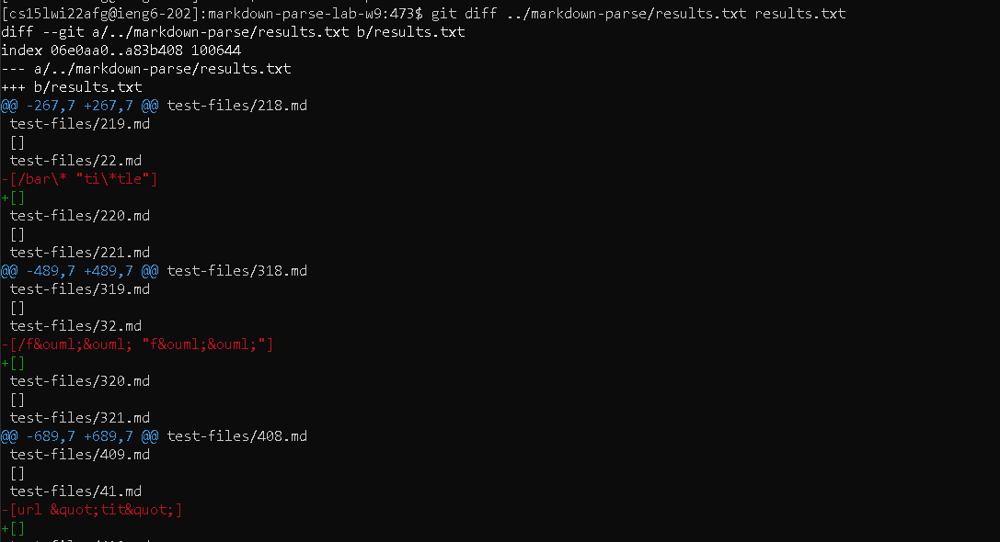
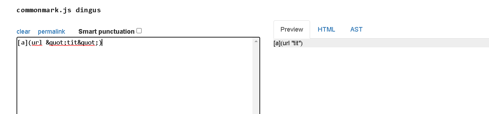
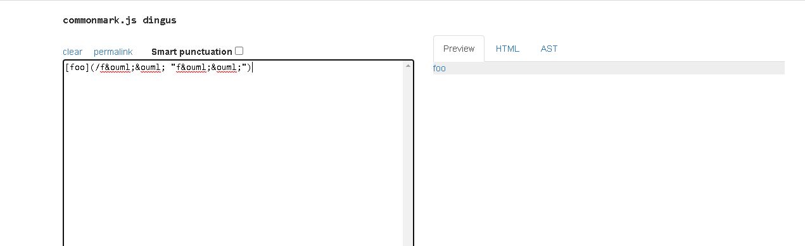

# Lab 5

I found the two tests with git diff



### Test 41

#### raw input

`[a](url &quot;tit&quot;)`

#### result



The fix is to check for a space in the middle by using indexOf after we trim the characters. I was thinking a fix like this would solve the issue at the end of the while loop, but before the adding of the section obviously.

```
if (content.indexOf(' ') != -1) {
  return;
}
```

### Test 32

For some reason I think mine is partially correct. Mine has a link while the instructors repository didn't get one. I don't have any idea how to change mine so that it has "föö" instead of "&ouml". The "föö" should be the most accurate result, but no way that happens. Also it doesn't make sense for a link with a space to be a valid link


#### raw input 

`[foo](/f&ouml;&ouml; "f&ouml;&ouml;")`

#### result



I think that the fix here is to check for the quotes and ignore that plus the space to make it so we only get `/f&ouml;&ouml;`. It would have to a subsection of the checking for a space in the middle. Might look something like:

```
if (content.indexOf(' ') != -1) {
  if (content.indexOf('/') != -1) {
    content = content.substring(0, content.indexOf(' '));
    return content;
  }
  else {
    return;
  }
}
```
